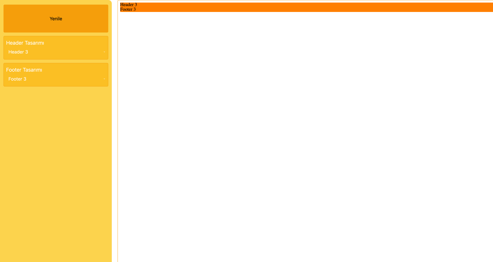

# SocketIO ile Gerçek Zamanlı Editör



Bu projede `HTML`, `CSS`, `JavaScript`, `Node`, `Socket.io` ve `PHP` kullanarak gerçek zamanlı bir tema editörü yaptık. Projeyi Çalışır bir şekilde ayağı kaldırmak için aşağıdaki adımları izleyebilirsiniz.


API'ı ayağı kaldırmak:
```bash
cd api && php -S ipadresi:8088
```

Node Server'ı ayağı kaldırmak:
```bash
cd node-server && node app.js
```

Socket Server'ı ayağı kaldırmak:
```bash
cd socket-server && node app.js
```

Projedeki, özellikle ``node-server`` ve ``socket-server`` klasörlerindeki app.js dosyalarının içinde bazı port bilgileri ve ip adreslerinin değişirilmesi gerekmektedir.